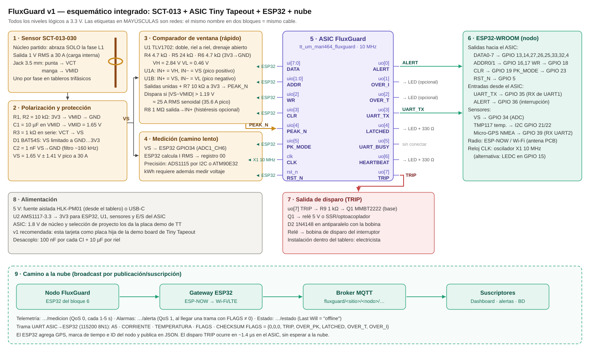

<!---

This file is used to generate your project datasheet. Please fill in the information below and delete any unused
sections.

You can also include images in this folder and reference them in the markdown. Each image must be less than
512 kb in size, and the combined size of all images must be less than 1 MB.
-->

## How it works

FluxGuard es un monitor de sobrecorriente y sobretemperatura para tableros eléctricos. Tiene dos caminos:

- **Camino rápido (hardware):** un transformador de corriente SCT-013 y un comparador de ventana externo generan
  `PEAK_N` cuando la corriente instantánea supera el umbral. El chip dispara `ALERT` y `TRIP` en unos 14 ciclos
  (~1.4 µs a 10 MHz), sin depender del microcontrolador.
- **Camino lento (medición):** un ESP32 mide la corriente RMS y la temperatura, y escribe las lecturas de 8 bits por
  un bus paralelo. El chip las compara contra umbrales programables y envía una trama UART con el estado.

### Registros del bus

Seleccionados con `ADDR = uio[1:0]`, dato en `ui[7:0]`, escritura en el flanco de subida de `WR = uio[2]`:

| ADDR | Registro               | Escala      | Valor tras reset |
|------|------------------------|-------------|------------------|
| 00   | Corriente RMS          | 0.25 A/LSB  | 0                |
| 01   | Temperatura            | 1 °C/LSB    | 0                |
| 10   | Umbral de corriente    | 0.25 A/LSB  | 100 (25.0 A)     |
| 11   | Umbral de temperatura  | 1 °C/LSB    | 60 (60 °C)       |

- `OVER_I` / `OVER_T` se activan cuando la lectura supera su umbral y se liberan cuando baja de (umbral − 4 LSB)
  (histéresis de 1 A / 4 °C).

### Camino rápido (SCT-013)

- `PEAK_N = uio[4]` es activo en bajo (salida de drenaje abierto del comparador con pull-up de 10 kΩ).
- Se sincroniza con 2 flip-flops y se filtra: un pulso debe durar al menos 8 ciclos (0.8 µs) para contar como pico
  válido. Así se rechazan los picos de ruido.
- Cada pico válido recarga un temporizador de retención de 2^18 ciclos (~26 ms). Ese tiempo es mayor que medio
  ciclo de red (8.3 ms a 60 Hz), así que `OVER_PK` se mantiene mientras haya un pico en cada semiciclo.
- `PK_MODE = uio[5]`:
  - `0`: dispara con el primer pico válido (protección instantánea).
  - `1`: tolera la corriente de arranque de motores; exige 6 picos seguidos (~50 ms a 60 Hz) antes de disparar.
- `TRIP = uo[7]` se memoriza. Solo se rearma con un flanco en `CLR` cuando ya no hay picos recientes.

### Alarmas y trama UART

- `ALERT = OVER_I | OVER_T | OVER_PK`.
- `LATCHED` memoriza cualquier alarma hasta un flanco de subida en `CLR = uio[3]`. `CLR` no tiene efecto mientras la
  condición siga activa.
- En cada escritura de corriente o temperatura, o cuando cambia el estado de las alarmas, se envía por `UART_TX`
  (115200 baud, 8N1 con reloj de 10 MHz) una trama de 5 bytes:
  `0xA5, CORRIENTE, TEMPERATURA, FLAGS, CHECKSUM`, donde
  `FLAGS = {3'b0, TRIP, OVER_PK, LATCHED, OVER_T, OVER_I}` y `CHECKSUM = CORRIENTE ^ TEMPERATURA ^ FLAGS`.
  Los bits 2..0 son iguales a la versión anterior.
- `HEARTBEAT` parpadea a ~1.2 Hz para indicar que el chip está vivo.

## How to test

1. Aplica un reloj de 10 MHz y un pulso de reset (`rst_n` en bajo). Deja `PEAK_N` (uio[4]) en alto.
2. Conecta `UART_TX` (uo[3]) a un adaptador USB-serie a 115200 baud 8N1.
3. Para escribir un registro: pon el dato en `ui[7:0]` y la dirección en `uio[1:0]`, luego sube `WR` (uio[2]) al
   menos 3 ciclos de reloj y bájalo, manteniendo DATA/ADDR estables mientras `WR = 1`.
4. Escribe una corriente de 120 (30 A): `ALERT`, `OVER_I` y `LATCHED` se encienden y llega la trama
   `A5 78 00 05 7D`.
5. Escribe una corriente de 90 (22.5 A): `ALERT` se apaga y `LATCHED` sigue encendido. Da un pulso en `CLR` para
   borrarlo.
6. Camino rápido: con `PK_MODE = 0`, pon `PEAK_N` en bajo durante al menos 1 µs. `ALERT` y `TRIP` se encienden en
   ~1.4 µs y llega una trama con `FLAGS = 0x1C`. Unos 26 ms después `ALERT` se apaga (trama `0x14`) y `TRIP` queda
   memorizado hasta un pulso en `CLR`.
7. Con `PK_MODE = 1`, 3 pulsos en `PEAK_N` separados 8 ms no disparan; 6 pulsos seguidos sí.

Simulación: `cd test && make -B` (cocotb) o, sin cocotb,
`iverilog -g2012 -o sim.vvp ../src/tt_um_mari464_fluxguard.v tb_fluxguard.v && vvp sim.vvp`.

## External hardware

Ver el esquemático de arriba. Resumen:

- **Sensor:** SCT-013-030 (1 V RMS = 30 A) abrazando **un solo conductor** de fase. Uno por fase.
- **Polarización:** divisor 10 kΩ/10 kΩ con 10 µF a VMID = 1.65 V; 1 kΩ en serie y BAT54S como protección.
- **Comparador de ventana:** TLV1702 (doble, riel a riel, drenaje abierto). Umbrales con 4.7 kΩ / 24 kΩ / 4.7 kΩ:
  VH = 2.84 V y VL = 0.46 V, es decir ±1.19 V alrededor de VMID ≈ 25 A RMS senoidal (35.6 A pico).
  Salidas unidas con pull-up de 10 kΩ → `PEAK_N`. Para otro umbral: ΔV = I_RMS × √2 × (1 V / 30 A).
- **Microcontrolador:** ESP32 que mide la corriente RMS (ADC o ADS1115), lee la temperatura (TMP117 por I2C) y el
  GPS, escribe los registros y envía los datos por ESP-NOW/Wi-Fi a un broker MQTT.
- **Disparo:** `TRIP` → 1 kΩ → transistor MMBT2222 → relé o SSR → bobina de disparo del interruptor. La instalación
  dentro del tablero debe hacerla un electricista.
- LEDs opcionales en `ALERT`, `LATCHED` y `HEARTBEAT`.
